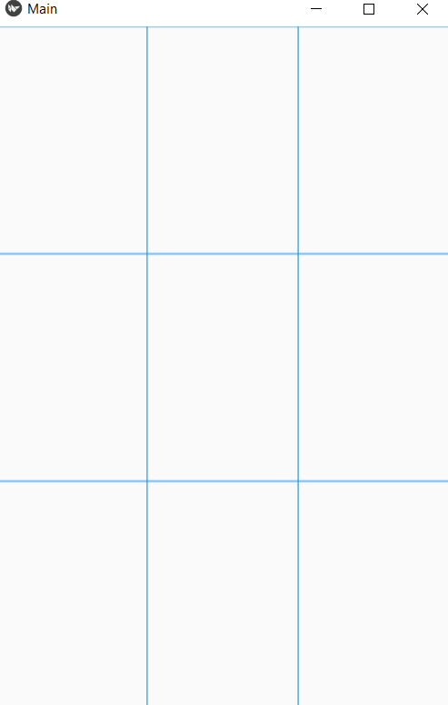
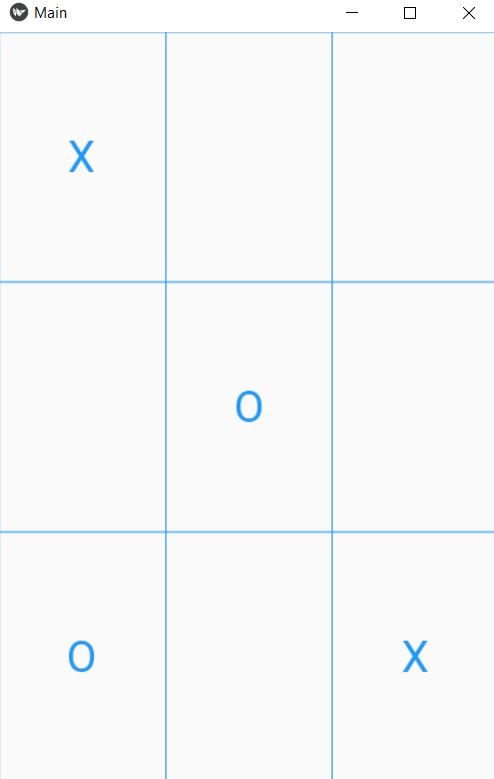
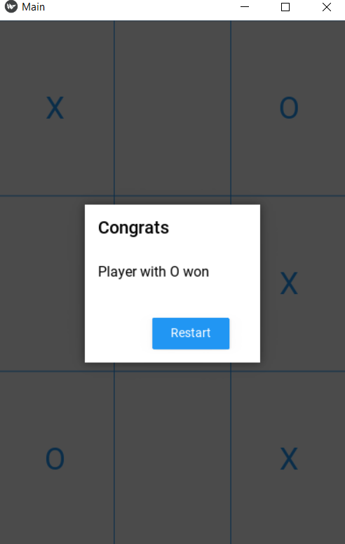

# TicTacToe-App-with-Kivy
A full TicTacToe App developed with Kivy,Python and Kiyvmd

## Features

* 2 Players can play TicTacToe with X and O
* When a Player wins he will shown a dialog with a congrats message
* When it is Tie, you will be shown a dialog with TIE message
* After players finish playing, they can restart the game 

## Screenshots
 

